This file describes and models growth in demand for **H2A** agricultural guest workers among U.S. employers from 2008-2018. The first section of the file downloads and combines recorded employer petitions for guest workers. These records constitute a direct indicator of demand for agricultural guest workers as they record every  official request for guest workers made by U.S. employers. Throughout the analysis, I will aggregate these data at the state, year, and state-year levels to document various patterns. The final stage estimates a set of predictive models, which can be used to estimate state-level demand for guest workers in future years.


### Load packages
First, the program will load necessary packages for the analysis


```r
library(purrr)
library(xlsx)
library(tidyverse)
library(readxl)
library(stringr)
library(lubridate)
library(maps)
library(ggrepel)
library(ggmap)
library(ggthemes)
library(viridis)
library(mapproj)
library(SemNetDictionaries)
library(mlbench)
library(caTools)
library(caret)
library(glmnet)
library(grid)
library(lattice)
library(e1071)
library(corrplot)
library(tidytext)
library(RANN)
library(RWeka)
library(cowplot)
```


# Data Prep
The first section of this report describes the data download and processing procedures that were used to ready the file for analyis.


#### Data download:
This code chunk will download the excel files from the [DOL website](https://www.foreignlaborcert.doleta.gov/performancedata.cfm) and write them to .xlsx files in the data directory.


```r
##List dol urls and destination file names to prep for download
dol_urls <- list ("https://www.foreignlaborcert.doleta.gov/docs/h_2a/H2A_FY2008.xlsx","https://www.foreignlaborcert.doleta.gov/docs/h_2a/H2A_FY2009.xlsx",
              "https://www.foreignlaborcert.doleta.gov/docs/h_2a/H-2A_FY2010.xlsx","https://www.foreignlaborcert.doleta.gov/docs/h_2a/H-2A_FY2011.xlsx",
              "https://www.foreignlaborcert.doleta.gov/docs/h_2a/H-2A_FY2012.xlsx","https://www.foreignlaborcert.doleta.gov/docs/h_2a/H2A_FY2013.xls",
              "https://www.foreignlaborcert.doleta.gov/docs/py2014q4/H-2A_FY14_Q4.xlsx","https://www.foreignlaborcert.doleta.gov/docs/py2015q4/H-2A_Disclosure_Data_FY15_Q4.xlsx",
              "https://www.foreignlaborcert.doleta.gov/docs/Performance_Data/Disclosure/FY15-FY16/H-2A_Disclosure_Data_FY16_updated.xlsx","https://www.foreignlaborcert.doleta.gov/pdf/PerformanceData/2017/H-2A_Disclosure_Data_FY17.xlsx",
              "https://www.foreignlaborcert.doleta.gov/pdf/PerformanceData/2018/H-2A_Disclosure_Data_FY2018_EOY.xlsx",
              "https://www.foreignlaborcert.doleta.gov/pdf/PerformanceData/2019/H-2A_Disclosure_Data_FY2019.xlsx")
dol_files <- list("data/H2A_08.xlsx","data/H2A_09.xlsx","data/H2A_10.xlsx","data/H2A_11.xlsx","data/H2A_12.xlsx","data/H2A_13.xls","data/H2A_14.xlsx",
                   "data/H2A_15.xlsx","data/H2A_16.xlsx","data/H2A_17.xlsx","data/H2A_18.xlsx", "data/H2A_19.xlsx")

map2(dol_urls, dol_files, download.file, mode = "wb")

write.xlsx(read_xls("data/H2A_13.xls", na = c("", " ", "N/A", "N/a", "n/A", "n/a"), col_names = T, guess_max = 12000),"data/H2A_13.xlsx")
```


#### Data wrangling
The below code chunk will Merge the annual data files and construct the state-level dataset. To avoid redundancy, this code restricts the data to only include sub-records. Per the **DOL** instructions, multiple growers can submit a single petition for workers. In these instances, redundancy occurs between the group submission and the included sub-records. It is necessary to remove the primary records and retain the sub-records because the sub-records can be spread across multiple states. Thus, removing the primary (or group) records could obscure important spatial patterns in demand for agricultural guest workers among U.S. growers.


```r
###Read in files and prep data for analysis#####################
files_h2a <- dir(path = "data/", pattern = "^H2A_.*xlsx$")
files_h2a <- paste0('data/', files_h2a)

read_h2a <- function(x, y = "H2A") { read_xlsx(x, na = c("", " ", "N/A", "N/a", "n/A", "n/a"), col_names = T, guess_max = 12000) %>%
    rename_all(toupper) %>%
    mutate(VISA_CLASS = y,
           file = x) %>%
    dplyr::select(one_of(c("CASE_NO", "CASE_NUMBER")), EMPLOYER_NAME, VISA_CLASS, one_of(c("DECISION_DATE","RECENT_DECISION_DATE")), CASE_STATUS,
                  EMPLOYER_STATE, EMPLOYER_CITY, one_of("CERTIFICATION_BEGIN_DATE", "REQUESTED_START_DATE_OF_NEED"), one_of("CERTIFICATION_END_DATE", "REQUESTED_END_DATE_OF_NEED"), EMPLOYER_POSTAL_CODE, NBR_WORKERS_CERTIFIED, JOB_TITLE, file, AGENT_ATTORNEY_NAME,
                  contains("WORKSITE_STATE"), contains("WORK_STATE"), contains("WORKSITE_LOCATION_STATE"),
                  contains("WORKSITE_CITY"), contains("WORK_CITY"), contains("WORKSITE_LOCATION_CITY"), one_of("ORGANIZATION_FLAG", "PRIMARY_SUB", "SUB", "PRIMARY/SUB")
    )
}
h2a_data <- files_h2a %>%
  purrr::map(read_h2a) %>%
  reduce(bind_rows) %>%
  mutate(WORK_CITY = ifelse(!is.na(ALIEN_WORK_CITY), ALIEN_WORK_CITY,
                            ifelse(!is.na(WORKSITE_LOCATION_CITY), WORKSITE_LOCATION_CITY,
                                   WORKSITE_CITY)),
         WORK_STATE = ifelse(!is.na(ALIEN_WORK_STATE), ALIEN_WORK_STATE,
                             ifelse(!is.na(WORKSITE_LOCATION_STATE), WORKSITE_LOCATION_STATE,
                                    WORKSITE_STATE))) %>%
  dplyr::select(-WORKSITE_LOCATION_STATE, -WORKSITE_STATE, -ALIEN_WORK_STATE, -ALIEN_WORK_CITY, -WORKSITE_LOCATION_CITY, -WORKSITE_CITY)

#Lower case
names(h2a_data) <- str_to_lower(names(h2a_data))
h2a_data %>%
  mutate(case_no = ifelse(is.na(case_no), case_number, case_no)) %>%
  dplyr::select(-case_number) -> h2a_data
h2a_data$year <- (str_sub(h2a_data$file, 10, 11))
h2a_data$year <- as.numeric(h2a_data$year)
h2a_data$year <- h2a_data$year+2000

##Restrict to sub-records only
h2a_data %>%
  group_by(case_no, year) %>%
  mutate(APPS = n(),
         association = ifelse(APPS>1, 1, 0),
         MAX = max(nbr_workers_certified)) %>%
  ungroup() %>%
  mutate(primary = ifelse(association==1 & MAX==nbr_workers_certified, 1, 0)) %>%
  filter(primary==0) %>%
  filter(!is.na(nbr_workers_certified)) -> h2a_data

###Case outcome
h2a_data$outcome <- h2a_data$case_status %>%
  str_replace_all(c("Certification" = "certified", "CERTIFIED" = "certified", "Certified" = "certified", "Certified - Full" = "certified",
                    "certified - Full" = "certified", "DETERMINATION ISSUED - CERTIFICATION" = "certified", "FINAL REVIEW" = "certified",
                    "Certified - Partial" = "partial", "DETERMINATION ISSUED - PARTIAL CERTIFICATION" = "partial", "Partial Certification" = "partial",
                    "Partial Certified" = "partial", "PARTIAL CERTIFIED" = "partial", "certified - Partial" = "partial", "Partial certified" = "partial", "PARTIAL certified" = "partial",
                    "Denied" = "denied", "DENIED" = "denied", "REJECTED" = "denied", "DETERMINATION ISSUED - denied" = "denied",
                    "DETERMINATION ISSUED - PARTIAL CERTIFICATION EXPIRED" = "expired", "Partial Certification Expired" = "expired", "certified Expired" = "expired",
                    "Partial certified Expired" = "partial", "partial EXPIRED" = "expired", "certified certified EXPIRED" = "expired", "partial Expired" = "expired",
                    "certified EXPIRED" = "expired",
                    "DETERMINATION ISSUED - WITHDRAWN" = "withdrawn", "Withdrawn" = "withdrawn", "WITHDRAWN" = "withdrawn"))

h2a_data$Outcome <- factor(h2a_data$outcome,
                           levels = levels(factor(h2a_data$outcome)),
                           labels = c("Certified", "Denied", "Expired", "Partial", "Withdrawn"))
h2a_data$Outcome <- relevel(h2a_data$Outcome, "Certified", "Partial", "Expired", "Withdrawn", "Denied")

##Save H2A master data to H2A.rda
save(h2a_data, file = "rda/H2a_data.rda")

##Save Annual H2A data to H2A_annual_data.rda
h2a_data %>%
  group_by(year) %>%
  summarise(H2A = sum(nbr_workers_certified, na.rm = T),
            mean_workers = mean(nbr_workers_certified,na.rm=TRUE),
            median_workers = median(nbr_workers_certified,na.rm=TRUE)) -> annual_data
save(annual_data, file = "rda/H2A_annual_data.rda")
```


#### Employer-level data

```
## Classes 'tbl_df', 'tbl' and 'data.frame':	112454 obs. of  28 variables:
##  $ case_no                     : chr  "C-07243-06148" "C-07256-06229" "C-07248-06159" "C-07263-06300" ...
##  $ employer_name               : chr  "BENJAMIN SEIDLER" "AL CRAMER FARMS" "LARRY D. WOMACK- WOMACK NURSERY CO" "DALE HENSGENS FARM" ...
##  $ visa_class                  : chr  "H2A" "H2A" "H2A" "H2A" ...
##  $ decision_date               : POSIXct, format: "2007-10-01 08:52:51" "2007-10-01 08:58:02" ...
##  $ case_status                 : chr  "Certified - Full" "Certified - Full" "Certified - Full" "Certified - Full" ...
##  $ employer_state              : chr  "ND" "LA" "TX" "LA" ...
##  $ employer_city               : chr  "UNDERWOOD" "BRANCH" "DELEON" "BRANCH" ...
##  $ certification_begin_date    : POSIXct, format: "2007-11-01" "2007-11-01" ...
##  $ certification_end_date      : POSIXct, format: "2008-04-30" "2008-08-30" ...
##  $ employer_postal_code        : chr  "58576" "70516" "76444" "70516" ...
##  $ nbr_workers_certified       : num  2 3 5 8 12 10 10 7 8 2 ...
##  $ job_title                   : chr  "FARM WORKER, GENERAL" "FARMWORKER, RICE" "HORTICULTURAL WORKER II" "GENERAL FARM WORKER" ...
##  $ file                        : chr  "data/H2A_08.xlsx" "data/H2A_08.xlsx" "data/H2A_08.xlsx" "data/H2A_08.xlsx" ...
##  $ agent_attorney_name         : chr  "LESLI DOWNS & KRIS GOSNEY" "KELLY  J. COUCH, CONSULTANT" "HELEEN VAN TONDER" "KELLY J. COUCH" ...
##  $ organization_flag           : chr  "S" "S" "S" "S" ...
##  $ requested_start_date_of_need: POSIXct, format: NA NA ...
##  $ requested_end_date_of_need  : POSIXct, format: NA NA ...
##  $ primary/sub                 : chr  NA NA NA NA ...
##  $ primary_sub                 : chr  NA NA NA NA ...
##  $ work_city                   : chr  "UNDERWOOD" "BRANCH" "DELEON" "BRANCH" ...
##  $ work_state                  : chr  "ND" "LA" "TX" "LA" ...
##  $ year                        : num  2008 2008 2008 2008 2008 ...
##  $ APPS                        : int  1 1 1 1 1 1 1 1 1 1 ...
##  $ association                 : num  0 0 0 0 0 0 0 0 0 0 ...
##  $ MAX                         : num  2 3 5 8 12 10 10 7 8 2 ...
##  $ primary                     : num  0 0 0 0 0 0 0 0 0 0 ...
##  $ outcome                     : chr  "certified" "certified" "certified" "certified" ...
##  $ Outcome                     : Factor w/ 5 levels "Certified","Denied",..: 1 1 1 1 1 1 1 1 1 1 ...
```


#### Annual data

```
## # A tibble: 12 x 4
##     year    H2A mean_workers median_workers
##    <dbl>  <dbl>        <dbl>          <dbl>
##  1  2008  87038         11.1              4
##  2  2009  82931         11.6              4
##  3  2010  75821         11.8              4
##  4  2011  75416         11.4              4
##  5  2012  83650         11.2              4
##  6  2013  95984         12.1              4
##  7  2014 113388         12.3              4
##  8  2015 136528         13.6              4
##  9  2016 160752         15.0              5
## 10  2017 193100         16.9              5
## 11  2018 238659         18.1              5
## 12  2019 253782         17.5              5
```


#### H2A Migration is growing as other forms of immigration decline
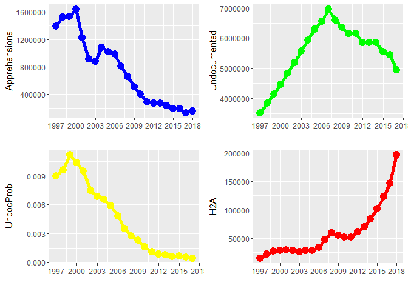<!-- -->
**Caption**: The annual number of Mexicans apprehended attempting to enter the United States without authorization (top left), the estimated number of Mexicans living in the United States without authorization (top right), the annual proability of undocumented entry into the United States among Mexican adults according to the Mexican Migration Project (bottom left), and the number of H2A visas certified by the Department of Homeland Security each year (bottom right).


# Spatial patterns


#### Prep spatial data
This code chunk constructs the state-year data file and merges it with a spatial file for the United States that can be used for geographic analyis such as mapping.


```r
data("state.fips")
head(state.fips)
```

```
##   fips ssa region division abb    polyname
## 1    1   1      3        6  AL     alabama
## 2    4   3      4        8  AZ     arizona
## 3    5   4      3        7  AR    arkansas
## 4    6   5      4        9  CA  california
## 5    8   6      4        8  CO    colorado
## 6    9   7      1        1  CT connecticut
```

```r
states <- state.fips
states %>%
  rename("census_region" = "region",
         "region" = "polyname") -> states
states$region <- str_to_lower(states$region)
states$region <- str_replace(states$region,":.*","")
states <- states %>% right_join(states %>% distinct(abb))
state <- map_data("state")
ggplot(data=state) +
  geom_polygon(aes(x=long, y=lat, group=group), color="white") -> state_base


#Generate region var in h2a_data
h2a_data$abb <- ifelse(is.na(h2a_data$work_state), h2a_data$employer_state, h2a_data$work_state)
h2a_data %>%
  filter(!is.na(abb)) %>%
  group_by(abb, year) %>%
  summarise(Applicants = n(),
            Workers = sum(nbr_workers_certified, na.rm=T)) %>%
  arrange(year) %>%
  mutate(Applicants_chg = ifelse(Applicants-lag(Applicants, 11)>0, Applicants-lag(Applicants, 11), 1),
         Applicants_pct = ifelse(Applicants_chg>0, Applicants_chg/lag(Applicants, 11)*100, 1),
         Workers_chg = ifelse(Workers-lag(Workers, 11)>0, Workers-lag(Workers, 11), 1),
         Workers_pct = ifelse(Workers_chg>0, Workers_chg/lag(Workers, 11)*100, 1)) %>%
  left_join(states, by = "abb") -> h2a_state

h2a_state %>%
  inner_join(state, by = "region") -> h2a_map ##Data for all years
h2a_map$division <- factor(h2a_map$division,
                             levels=c(1:9),
                             labels = c("East North Central", "West North Central", "Mid-Atlantic", "New England", "East South Central", "South Atlantic", "West South Central", "Mountain", "Pacific"))


###Remove axes from maps & set map specs
ditch_the_axes <- theme(
  axis.text = element_blank(),
  axis.line = element_blank(),
  axis.ticks = element_blank(),
  panel.border = element_blank(),
  panel.grid = element_blank(),
  axis.title = element_blank()
)

##Set map theme
theme_size <-  theme(legend.position = c(.35, 0.8),
        panel.grid = element_blank(), legend.title = element_blank(),
        axis.title = element_blank(),
        legend.text = element_text(color = 'black', size = 16),
        legend.background = element_rect(fill = "gray85"),
        legend.key = element_rect(fill = "gray85"),
        axis.text = element_text(color = 'black', size = 12),
        panel.background = element_rect(fill = "gray85"))


##Prep mapping function
p_map <- function(data1,var1,time) {
cnames <- aggregate(cbind(Workers, group, Applicants) ~ region, data=data1 %>% filter(year==time), 
                    FUN=function(x)round(mean(range(x)),digits = 0)) %>%
  left_join(state_centroids, by = "region")
ggplot(data= subset(data1, year %in% c(time)), aes(long, lat, fill = (!! var1), group=group), color = "black") +
  geom_polygon() +
  geom_text(data=cnames, aes(x=long, y=lat, label=(!! var1), group=group),size=4) +
  theme_bw() +
  ditch_the_axes +
  scale_fill_gradientn(colours = rev(rainbow(7)),
                       name = "",
                       trans = "log10") +
  coord_fixed(ratio = 1.3) +
  theme(plot.margin=grid::unit(c(0,0,0,0), "mm"),
        text = element_text(size=8))
}
state_centroids <- read_csv("data/state_centroids.csv",col_names = T)
state_centroids$region <- tolower(state_centroids$region)
```


#### State level growth trends
This figure shows annual growth in demand for guest workers at the state-level. The plots are faceted by census region. The thick <span style="color: blue;">**blue**</span> lines show regional averages, while the thin <span style="color: red;">red</span> lines reflect individual states.

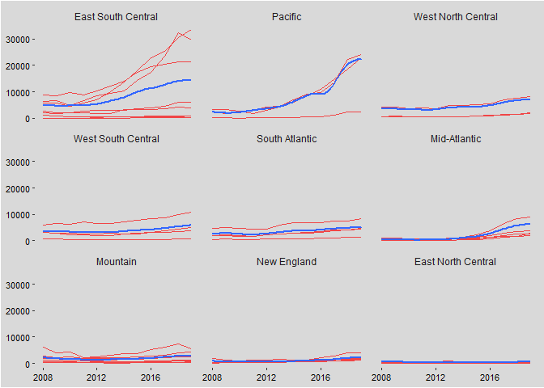<!-- -->


#### Annual maps
This figure maps the annual growth trend shown above.
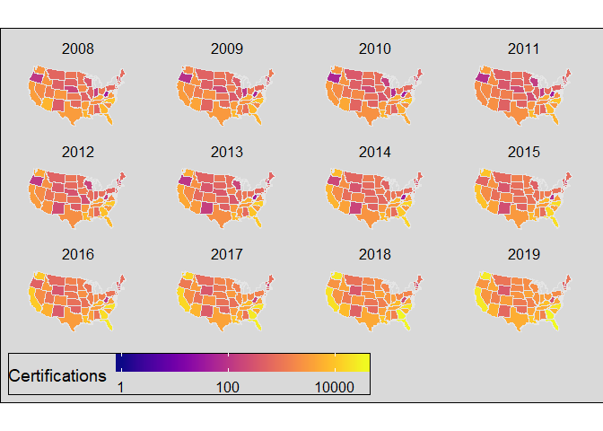<!-- -->


# Incorporate external variables

This code chunk will create new variables from external datasets and based on text in the included job titles. These additional variables will be used for predictive modeling

```r
#Merge farmworkers
read_csv("data/QCEW_State-Years.csv", col_names = T) %>%
  mutate("region" = str_to_lower((state)),
         "region" = str_remove(region, " -- statewide"),
         "farmworkers" = workers
  ) %>%
  dplyr::select(year, region, establishments, farmworkers) %>%
  inner_join(h2a_state, by = c("year", "region")) %>%
  dplyr::select(-Applicants_chg, - Applicants_pct, -Workers_chg, -Workers_pct) -> h2a_state_joint

#Insert lagged farmworker total
read_csv("data/QCEW_State-Years.csv", col_names = T) %>%
  mutate("region" = str_to_lower((state)),
         "region" = str_remove(region, " -- statewide"),
         "farmworkers" = workers
  ) %>%
  mutate(year = year+1,
         farmworkersL = farmworkers) %>%
  dplyr::select(region, year, farmworkersL) %>%
  right_join(h2a_state_joint, by = c("year","region")) -> h2a_state_joint

read_csv("data/State-Year ACS.csv", col_names=T) %>%
  mutate(    "region" = str_to_lower(statefip)) %>%
  dplyr::select(year,region, prophispanic,	propfiveorlessinUS,	propfhispanlimenglish,	prophispanlessthanhs,	yrsusa1
) %>%
  mutate(year = as.numeric(year)+1) %>%
  right_join(h2a_state_joint, by  = c("year", "region")) -> h2a_state_joint


#List spreadsheets with annual policy dummy vars & create list of variable titles
dummy_policy_vars <- c(excel_sheets("data/Enforcement_policies_Data.xlsx")[str_detect(excel_sheets("data/Enforcement_policies_Data.xlsx"),"(0,1)")])
policy_titles <- c("task_force", "jail", "secure", "detainers", "everify1", "everify2", "ominbus")

#Function to read in and gather data
read_policy <- function(x,y = "task_force") {
  y <- enquo(y)
  read_excel("data/Enforcement_policies_Data.xlsx", sheet = x,
                           col_names = c("region", "2000","2001","2002","2003","2004","2005","2006","2007","2008","2009","2010","2011","2012","2013","2014","2015","2016"),
                           range = "A3:R53") %>%
        mutate('2017' = `2016`) %>%
        gather('2000':'2017', value = !!y, key = year)

}

##Merge policy variables
purrr::map2(dummy_policy_vars, policy_titles, read_policy) %>%
  reduce(bind_cols) %>%
  select("region", "year", policy_titles) %>%
  mutate(year = as.numeric(year)+1,
         region = tolower(region)) %>%
  filter(year>2007) %>%
  right_join(h2a_state_joint, by = c("year","region")) -> h2a_state_joint


#Read in the undocumented immigrants data
read_excel("data/Undocumented Immigrant Trends.xlsx", sheet = "Sheet1",
                           col_names = c("region", "2000","2005","2006","2007","2008","2009","2010","2011","2012","2013","2014","2015","2016","2017"),
                           range = "A3:O47") %>%
        gather('2000':'2017', value = undocumented, key = year) %>%
  mutate(year=as.numeric(year)+1,
         region = tolower(region)) %>%
        right_join(h2a_state_joint, by = c("region","year")) -> h2a_state_joint


##########################
#Identify the proportion of H2A requests in each state that target fruit and vegetable workers
##########################

tidy_h2 <- h2a_data %>%
  dplyr::select(abb, job_title, year) %>%
  filter(!is.na(abb)) %>%
  mutate(id = row_number()) %>%
  unnest_tokens(word, job_title)
tidy_h2 %>%
  count(word) %>%
  arrange(desc(n))
```

```
## # A tibble: 1,293 x 2
##    word            n
##    <chr>       <int>
##  1 farm        39081
##  2 crop        34410
##  3 farmworker  31425
##  4 worker      27488
##  5 and         22101
##  6 laborers    20738
##  7 diversified 19297
##  8 farmworkers 14285
##  9 workers     12259
## 10 laborer     10588
## # ... with 1,283 more rows
```

```r
#Create fruits vector and veggies vector
veggies <- data.frame(word = vegetables.dictionary,
                      veggies = 1)
fruits <- data.frame(word = fruits.dictionary,
                     fruits = 1)

#Generate state-level proportions
tidy_h2 %>%
  left_join(fruits) %>%
  left_join(veggies) %>%
  group_by(id) %>%
  mutate(
    fruits = ifelse(is.na(fruits), 0, fruits),
    veggies = ifelse(is.na(veggies), 0, veggies),
    fruits = max(fruits),
    veggies = max(veggies),
    year = year-1) %>%
  group_by(abb, year) %>%
  summarize(fruits = mean(fruits),
            veggies = mean(veggies)) -> tidy_h2

##Plot states where fruit/vegetable workers are most commonly requested
tidy_h2 %>%
  group_by(abb) %>%
  summarize(fruits = mean(fruits),
            veggies = mean(veggies)) -> plot_words
plot_words$abbF = fct_reorder(plot_words$abb, plot_words$fruits)
plot_words$veggiesF = fct_reorder(plot_words$abb, plot_words$veggies)

#Merge data with h2a_state_joint
h2a_state_joint %>%
  left_join(tidy_h2, by = c("abb", "year")) -> h2a_state_joint
```


#### Fruit and Vegetable Workers
The figure below shows the proportion of applications per state that included either fruits or vegetables in the job titles within their visa requests. Fruits and vegetables were identified using the corresponding dictionaries included in the `Semnet` dictionary.
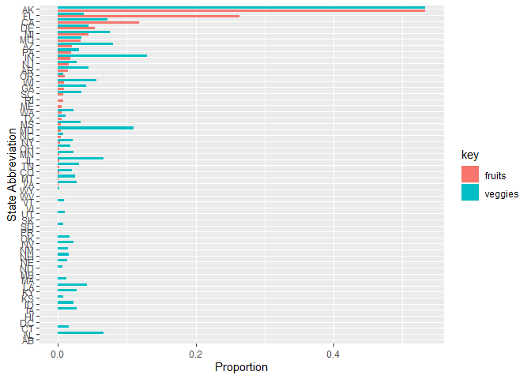<!-- -->


#### Guest Workers and Farmworkers
This figure describes the temporal relationship between total <span style="color: blue;">guest worker requests</span> and the total number of <span style="color: red;">farmworkers</span> in the United States and over time, both plotted on the primary axis to the left of the figure. The <span style="color: green;">ratio of H2A requests to total farmworkers</span> is plotted relative to the secondary axis to the right of the figure.
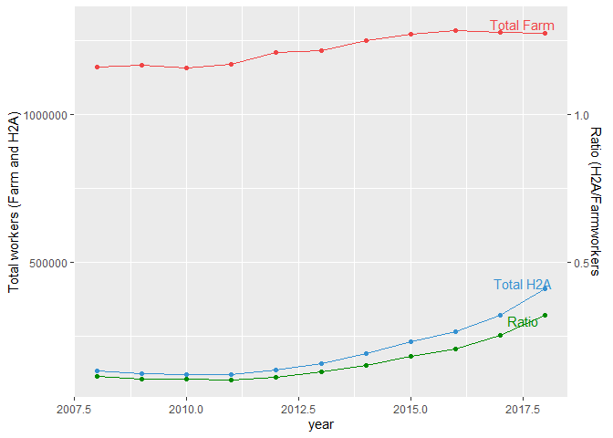<!-- -->


#### Guest Workers and Farmworkers over time
This figure contains annual scatterplots that show the relationship between farmworkers and H2A certifications at the state-level, with the <span style="color: blue;">**blue**</span> lines depicting the linear correlations The plot suggests an increasingly linear relationship as the number of farmworkers increases. However, the linear pattern appears to be driven in part by specific states that experienced rapid growth in their demand for H2A guest workers. The relationship between guest workers and all farmworkers increased from 0.29 in 2008 to 0.74 in 2018.
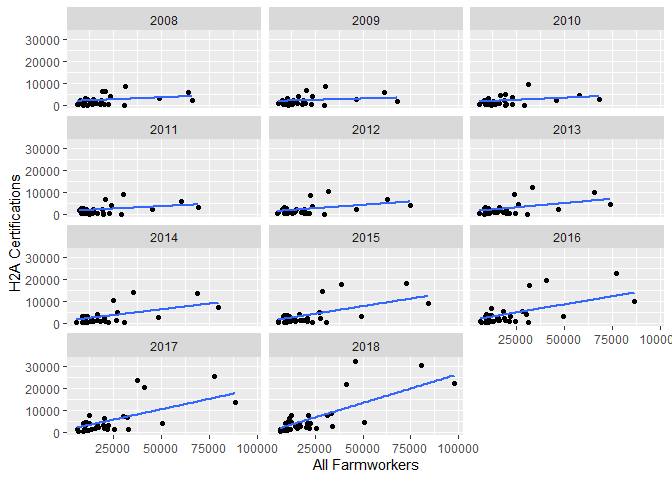<!-- -->


#### Guest workers and Farmworkers by State
This figure contains state-level scatterplots that graph the relationships between guet workers and all farmworker. The plot is faceted by the size of each state's farm workforce to show how the relationship between guest workers and farmworkers varies in states with different levels of agricultural activity. As the plots show, there is a strong positive relationship between guest workers and the size of the farm workforce in both more and less agrarian states.

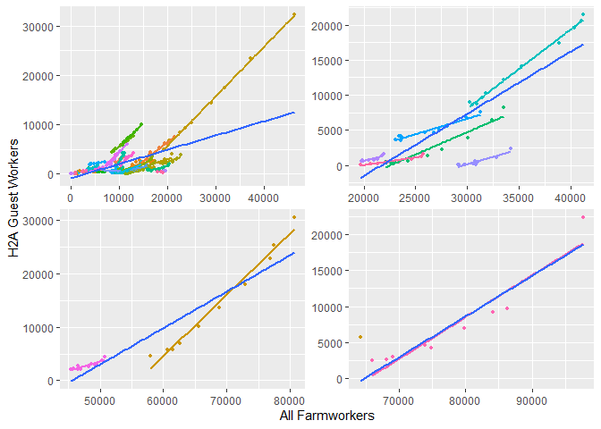<!-- -->


#### State-level ratios over time
These plots show trends in the ratio between **H2A** guest workers and all farmworkers in each state over time. The plots exclude states that never exceeded 5,000 total farmworkers. The ratios range from a low of **0** in Oregon in 2010 to a high of **1** in Georgia in 2018, with a national average of **0.17**

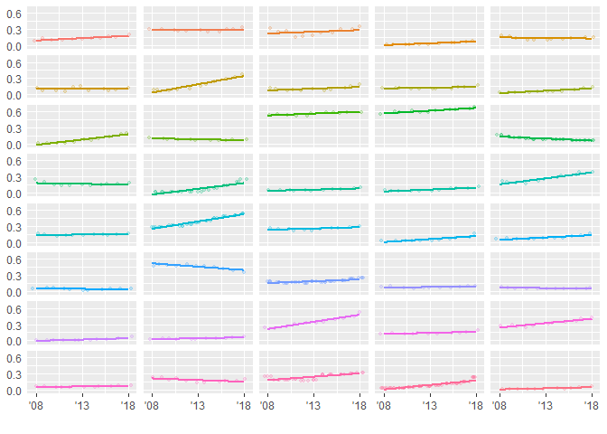<!-- -->


# Predictive Modeling
In this section, I will estimate a series of increasingly complex models that predict state-level demand for guest workers as a result of state-level demographic characteristics, immigration policies, agricultural intentensity, and crop type


#### Preprocess data prior to modeling
The below code processes the data prior to modeling. Given significant right skew in their distributions, I will use the natural logs of farmworkers and H2A guest workers throughout the models. Additionally, all of the features used to predict demand for guest workers in year T are measured in year T-1. I transformed all categorical variables into multiple binary variables. Then, all variables were centered and scaled and missing values were imputed using nearest neighbor imputation. The plot below shows a correlation matrix for all the features. One correlation exceeded 0.75 and the corresponding feature was removed.

```r
#Hyperparameters are preset characteristics defined before training. These could be the number of trees in a random forest or the weights used in a neural network


#Select variables of interest & preprocess data
h2a_state_joint %>% select(-region, -fips, -ssa, - census_region, -division, -farmworkers, -Applicants) %>%
  mutate(abb = factor(abb),
         farmworkersL = ifelse(farmworkersL==0,.00000001,farmworkersL),
         farmworkersL = log10(farmworkersL),
         Workers = log10(Workers),
         undocumented = log10(undocumented)) -> state_data


#Convert categorical variables to dummy variables
state_data$undocumented[is.na(state_data$undocumented)] <- 99999999
state_dummies <- model.matrix(Workers ~ . , data = state_data) %>% as.data.frame()
state_dummies$undocumented[state_dummies$undocumented==99999999] <- NA


#Preprocess data to center and scale variables
preProcValues <- preProcess(state_dummies[names(state_dummies)!="(Intercept)"], method = c("knnImpute", "center","scale"))
transformed <- predict(preProcValues, newdata = state_dummies[names(state_dummies)!="(Intercept)"])
state_data <- bind_cols(transformed, state_data %>% select(Workers))


##Plot correlations among prdictors
correlations <- cor(state_data %>% select(-Workers))
corrplot(correlations, order = "hclust", t1.cex = .3)
```

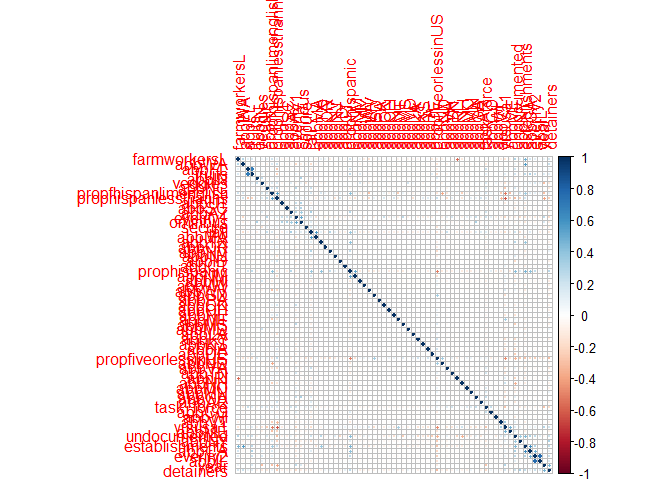<!-- -->

```r
#identify and remove highly correlated predictors
highCorr <- findCorrelation(correlations, cutoff =.75)
state_data <- state_data[,-highCorr]
correlations <- cor(state_data %>% select(-Workers))
highCorr <- findCorrelation(correlations, cutoff =.75)


#Create partition index
set.seed(1, sample.kind = "Rounding")
index <- createDataPartition(state_data$Workers, p = .7, list = FALSE)

h2_train_data <- state_data[index, ]
h2_train_x <- h2_train_data[,-ncol(h2_train_data)]
h2_train_y <- h2_train_data[,ncol(h2_train_data)]

h2_test_data <- state_data[-index, ]
```


#### Scatterplot of of pairwise relationships for all predictors
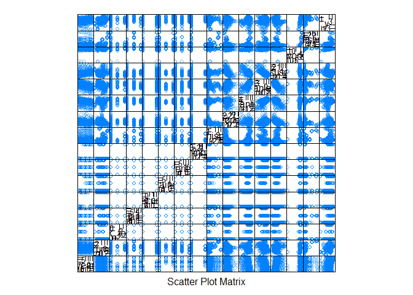<!-- -->


# Predictive Models


#### Estimate linear regression models
This code segment estimates a series of predictive linear models on the training set. The models include OLS regression, partial least squares, principal components analysis, lasso regression, and ridge regression. The Table printed at the bottom reports the best 

```r
#Establish repeated cross-validation scheme and define train function
fitControl <- trainControl(method = "repeatedcv",
                    number = 10,
                    repeats = 10)

trainF <- function(x) {
             train(Workers ~ .,
                   data = h2_train_data,
                   method = x,
                   trControl = fitControl,
                   tuneLength = 10,
                   verbose = FALSE)
}

#Run the initial train() function with a variety of linear regression models PLS model
linear_models <- list("lm", "pls", "pcr", "glmnet", "enet")

set.seed(1, sample.kind = "Rounding")
linear_results <- purrr::map(linear_models, trainF)
#linear_results1 <- linear_results[[2:5]]

#plot(linear_results[[2]], scales = list(x = list(log = 2)))
pull_data <- function(x) {
             Model <- x$modelInfo$label[1]
             RMSE <- min(x$results$RMSE)
             Rsquared <- max(x$results$Rsquared, na.rm = TRUE)
             bind_cols("Model" = Model, "RMSE" = RMSE,"Rsquared"=Rsquared)

}
linear_results %>%
  purrr::map(pull_data) %>%
  bind_rows() %>%
  arrange(RMSE) -> linear_specs
linear_specs
```

```
## # A tibble: 5 x 3
##   Model                         RMSE Rsquared
##   <chr>                        <dbl>    <dbl>
## 1 glmnet                       0.187    0.918
## 2 Linear Regression            0.188    0.918
## 3 Elasticnet                   0.188    0.915
## 4 Partial Least Squares        0.192    0.913
## 5 Principal Component Analysis 0.444    0.563
```


#### Linear Prediction Plots for LM and GLMNET, the two best performing models
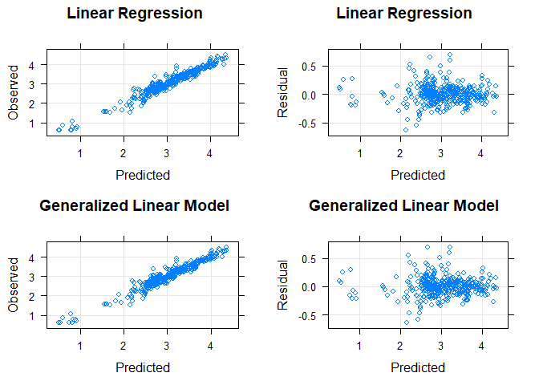<!-- -->


# Nonlinear Regression models


```r
#Neural Network
nnetGrid  <- expand.grid(.decay = c(0, 0.01, 0.1),
                         .size = c(1:10),
                         .bag = FALSE)
set.seed(1, sample.kind = "Rounding")
nnet_results <- train(Workers ~ .,
                      h2_train_data,
                      method='nnet',
                      linout=TRUE,
                      trace = FALSE)

#K-Nearest Neighbors
set.seed(1, sample.kind = "Rounding")
knn_results <- train(h2_train_x,
                     h2_train_y,
                     method = "knn",
                     tuneGrid = data.frame(.k = 1:20),
                     trControl = trainControl(method = "cv"))


list(nnet_results,knn_results) %>%
  purrr::map(pull_data) %>%
  bind_rows() %>%
  arrange(RMSE) -> nonlinear_specs
print("Non-linear Diagnostics")
```

```
## [1] "Non-linear Diagnostics"
```

```r
nonlinear_specs
```

```
## # A tibble: 2 x 3
##   Model                RMSE Rsquared
##   <chr>               <dbl>    <dbl>
## 1 k-Nearest Neighbors 0.137    0.958
## 2 Neural Network      0.170    0.934
```

```r
print("Updated Model Rankings")
```

```
## [1] "Updated Model Rankings"
```

```r
bind_rows(linear_specs,nonlinear_specs) %>%
  arrange(RMSE)
```

```
## # A tibble: 7 x 3
##   Model                         RMSE Rsquared
##   <chr>                        <dbl>    <dbl>
## 1 k-Nearest Neighbors          0.137    0.958
## 2 Neural Network               0.170    0.934
## 3 glmnet                       0.187    0.918
## 4 Linear Regression            0.188    0.918
## 5 Elasticnet                   0.188    0.915
## 6 Partial Least Squares        0.192    0.913
## 7 Principal Component Analysis 0.444    0.563
```


#### NonLinear Prediction Plots for nnet and knn, the two best performing models
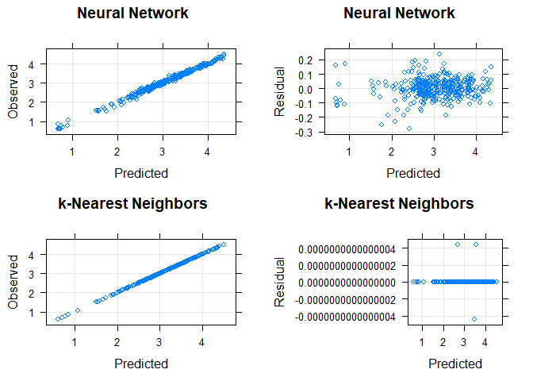<!-- -->


#### Tree-based Models


```r
###################
#Single trees using:
##################

#CART methodology
set.seed(1, sample.kind = "Rounding")
rpart_results <- train(h2_train_x,
                       h2_train_y,
                       method = "rpart2",
                       tuneLength = 10,
                       trControl = trainControl(method = "cv"))
#Conditional Inference methodology
set.seed(1, sample.kind = "Rounding")
ctree_results <- train(h2_train_x,
                       h2_train_y,
                       method = "ctree2")

###################
#Model trees using:
###################

#Model Tree (standard)
set.seed(1, sample.kind = "Rounding")
M5P_results <- train(h2_train_x,
                       h2_train_y,
                       method = "M5",
                       trControl = trainControl(method = "cv"),
                       control = Weka_control(M=10))


#Model Tree (rule-based)
set.seed(1, sample.kind = "Rounding")
ctree_results <- train(h2_train_x,
                       h2_train_y,
                       method = "M5Rules",
                       trControl = trainControl(method = "cv"),
                       control = Weka_control(M=10))


#Random Forest
set.seed(1, sample.kind = "Rounding")
rf_results <- train(Workers ~ .,
                   data = h2_train_data,
                   method = "rf",
                   trControl = fitControl,
                   tuneLength = 10,
                   verbose = FALSE)

#Boosted Trees
boostTree_results <- train(Workers ~ .,
                           data = h2_train_data,
                           method = "gbm",
                           trControl = fitControl,
                           tuneLength = 10,
                           verbose = FALSE)


##Compare the two models against one another

list(rpart_results, ctree_results, M5P_results, rf_results, boostTree_results) %>%
  purrr::map(pull_data) %>%
  bind_rows() %>%
  arrange(RMSE) -> tree_specs

print("Tree Model Diagnostics")
tree_specs


print("Final Rankings")
bind_rows(linear_specs,nonlinear_specs,tree_specs) %>%
  arrange(RMSE)
```


#### NonLinear Prediction Plots for nnet and knn, the two best performing models


#### Assessment of top four Models using Test Data


# Plotted Test Set Predictions using Neural Network Model


# Variable Importance
This figure plots the relative variable importance of explanatory variables in the neural network model used to generate the final predictions. Variable importance was determined using Garson's (1991) method. Variable importance for state dummies not shown. Not surprisingly, given steady annual growth in demand for guest workers, Year is the most important factor in predicting guest worker demand, followed by the number of establishments and farmworkers in each state. The next three factors, proportion Hispanics with less than a high school degree, the presence of a 287G agreement with jails, and the presence of an omnibus 287G agreement support a substitution effect through which, states heavily dependent on Hispanic farmworkers and those with more stringent anti-immigrant legislation increasingly rely on guest workers to fill out their agricultural labor forces.

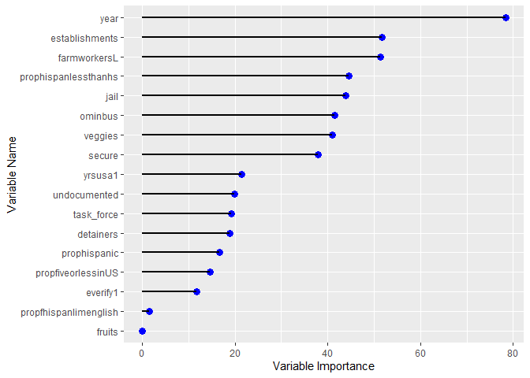<!-- -->
